# PyBer_Analysis

**Overview**

The purpose of this analysis is to create a summary DataFrame of the ride-sharing data by city type. Then, using Pandas and Matplotlib, create a multiple-line graph that shows the total weekly fares for each city type. Finally, a written report that summarizes how the data differs by city type and how those differences can be used by decision-makers at PyBer will be given.

**Deliverable 1: A ride-sharing summary DataFrame by city type**

The following requirements for Deliberable 1 are as follows:

    The total number of rides for each city type is retrieved.
    The total number of drivers for each city type is retrieved.
    The sum of the fares for each city type is retrieved.
    The average fare per ride for each city type is calculated.
    The average fare per driver for each city type is calculated.
    A PyBer summary DataFrame is created.
    The PyBer summary DataFrame is formatted as shown in the example.

Below are the fulfilled requirements for the deliverable. 

**Deliverable 1 Requirements**

1. The total number of rides for each city type is retrieved.

Code and Image
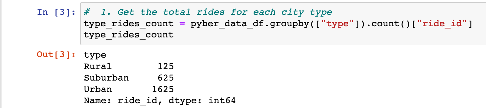

2. The total number of drivers for each city type is retrieved. 

Code and Image
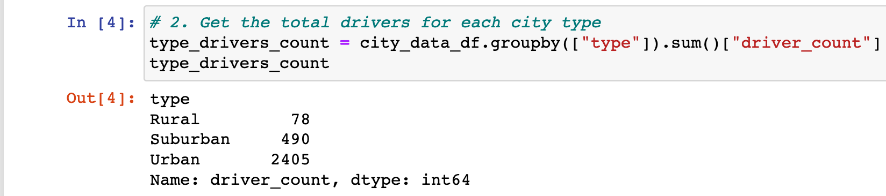

3. The sum of the fares for each city type is retrieved. 

Code and Image
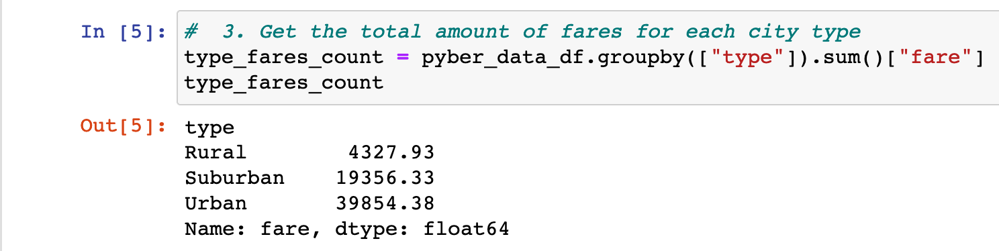

4. The average fare per ride for each city type is calculated. 

Code and Image
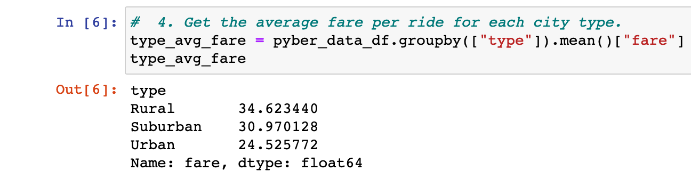

5. The average fare per driver for each city type is calculated. 

Code and Image
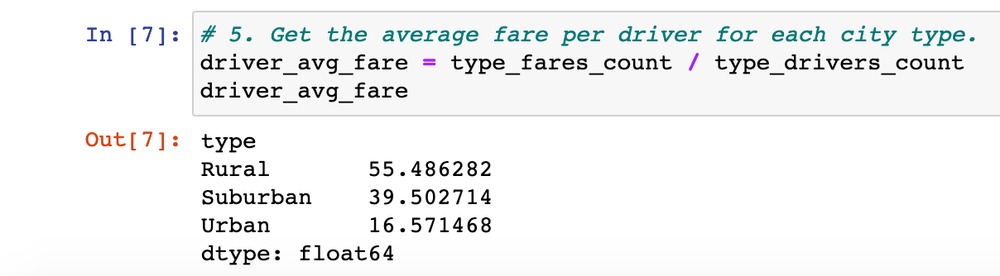

6. A PyBer summary DataFrame is created. 

Code and Image
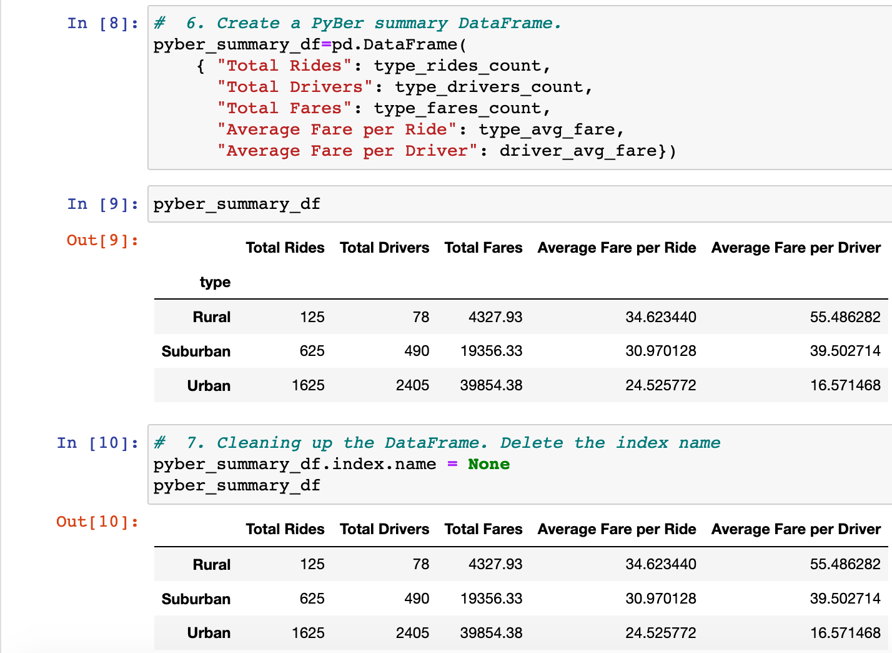

7. The PyBer summary DataFrame is formatted as shown in the example.

Code and Image
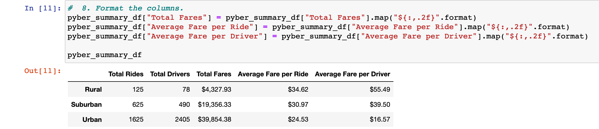

**Deliverable 2: A multiple-line chart of total fares for each city type**

The following requirements for Deliberable 2 are as follows:

    A DataFrame was created using the groupby() function on the "type" and "date" columns, and the sum() method is applied on the "fare" column to show the total fare amount for each date and time.
    A DataFrame was created using the pivot() function where the index is the "date," the columns are the city "type," and the values are the "fare."
    A DataFrame was created using the loc method on the date range: 2019-01-01 through 2019-04-29.
    A DataFrame was created using the resample() function in weekly bins and shows the sum of the fares for each week.
    An annotated chart showing the total fares by city type is created and saved to the "analysis" folder.

Below are the fulfilled requirements for the deliverable. 

**Deliverable 2 Requirements**

1. A DataFrame was created using the groupby() function on the "type" and "date" columns, and the sum() method is applied on the "fare" column to show the total fare amount for each date and time. 

Code and Image
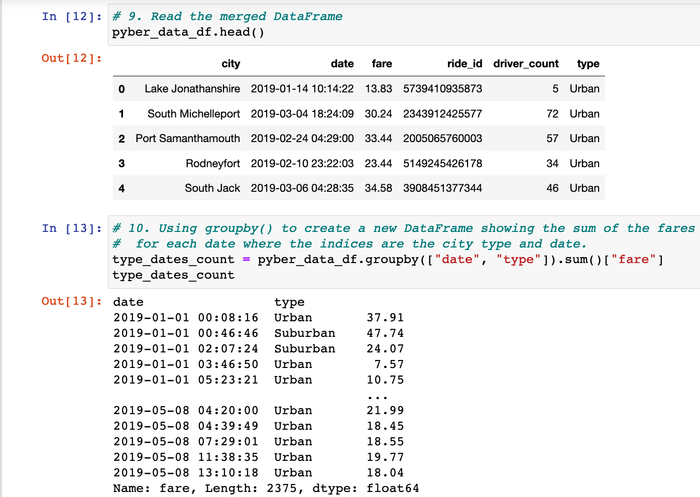

2. A DataFrame was created using the pivot() function where the index is the "date," the columns are the city "type," and the values are the "fare." 

Code and Image
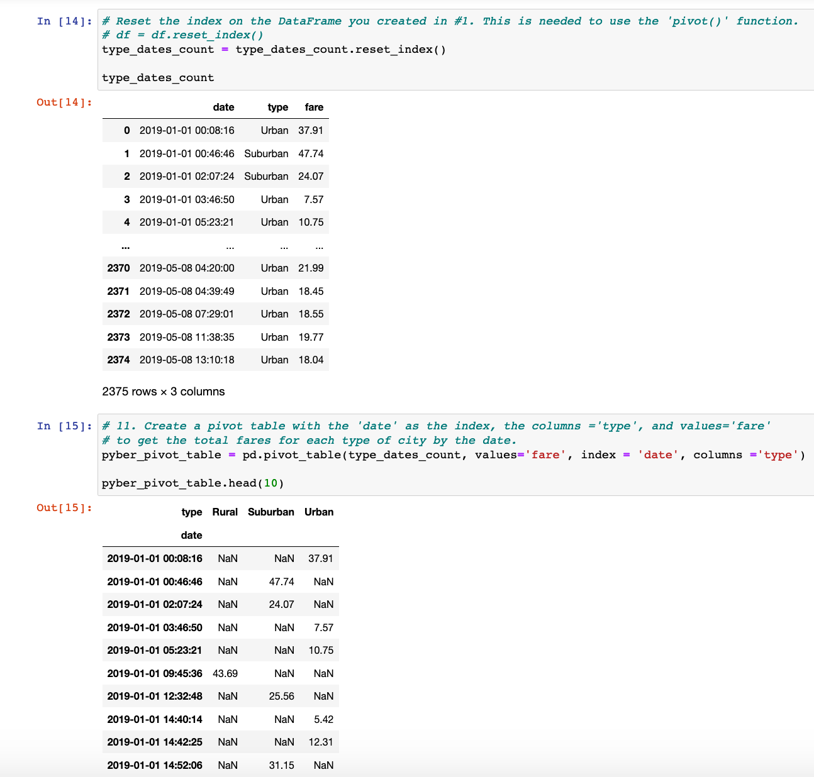

3. A DataFrame was created using the loc method on the date range: 2019-01-01 through 2019-04-29. 

Code and Image
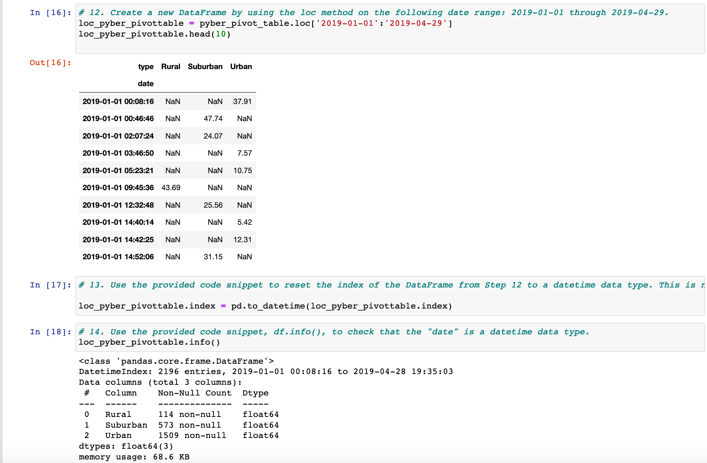

4. A DataFrame was created using the resample() function in weekly bins and shows the sum of the fares for each week. 

Code and Image
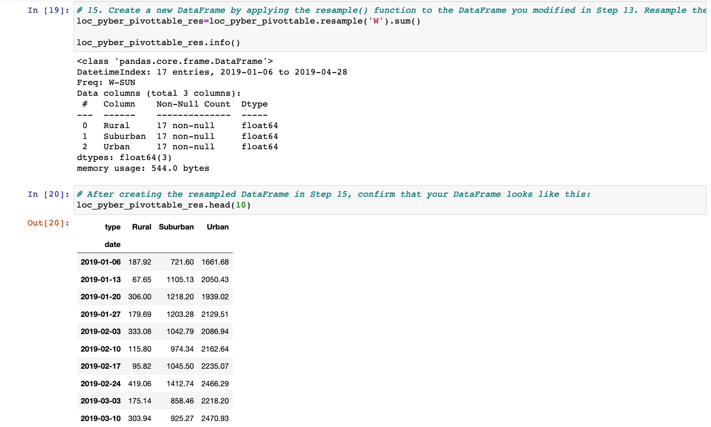

5. An annotated chart showing the total fares by city type is created and saved to the "analysis" folder. 

Code and Image
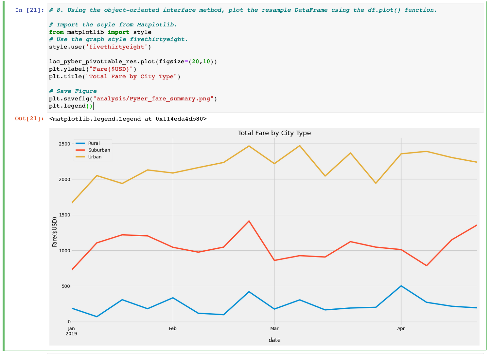

**Deliverable 3: A written report for the PyBer analysis**

The following requirements for Deliberable 2 are as follows:

    Overview of the analysis: Explain the purpose of the new analysis.
    Results: Using images from the summary DataFrame and multiple-line chart, describe the differences in ride-sharing data among the different city types.
    Summary: Based on the results, provide three business recommendations to the CEO for addressing any disparities among the city types.

**Deliverable 3 Requirements**

1. Overview of the analysis: Explain the purpose of the new analysis.

*please see introduction for the overview of the analysis for this deliberable requirement.*

2. Results: Using images from the summary DataFrame and multiple-line chart, describe the differences in ride-sharing data among the different city types.

The following images will illustrate the differences in ride-sharing data among the different city types.

Summary DataFrame Image
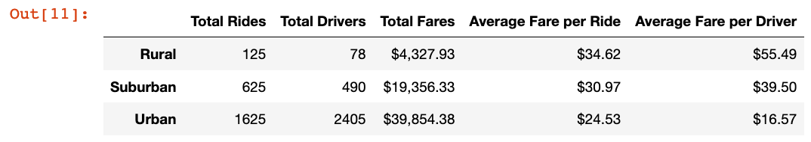

Multiple-line chart Image
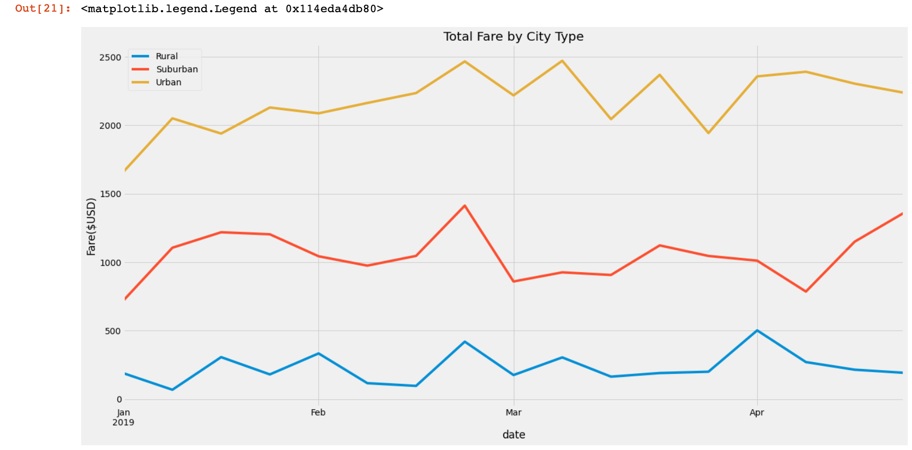

Scatter Plot chart Image
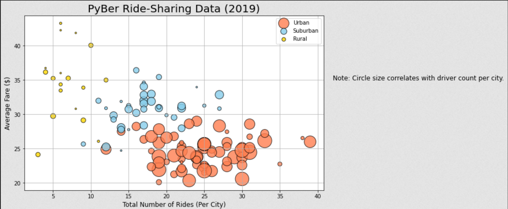

3. Summary: Based on the results, provide three business recommendations to the CEO for addressing any disparities among the city types.

Based on the results, the following business recommendations can be made to the CEO for addressing the disparities among the city types. 

1. I anticipate more growth in rural and suburban locations if the hiring of new dirivers is implemented.

- This graph illustrates the potential, including mean and range of drivers compared to the current urban centers.
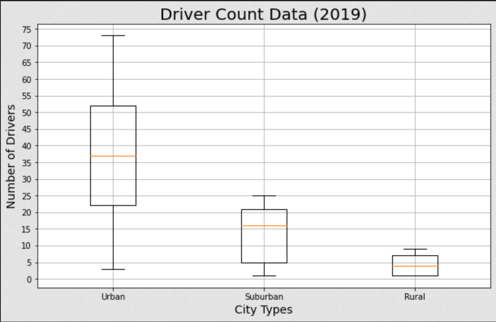

- This chart further illustrates the motif of expanding out to rural and surburban locations for drivers. Currently a small percentage in those areas, which should yeild promising opportunites for the buisnees if they wish to expand into them. 
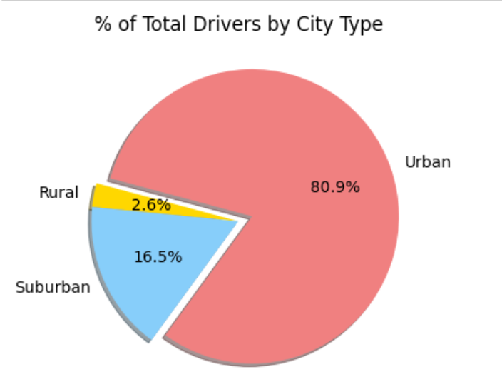

2. The graph illustrates the promising adeventure in expanding to suburban areas, since there is a huge demand for rides in the suburban areas when compared to the drivers available in that location (as well as the rural areas). This allows a great source of revenue for the company and could potentially be a steadys stream of income consistency, that is already shown in the urban ride demand as shown below. This could potentially provide the company with two sources of mainstream revenue, if further growth in suburban ares are implemented.
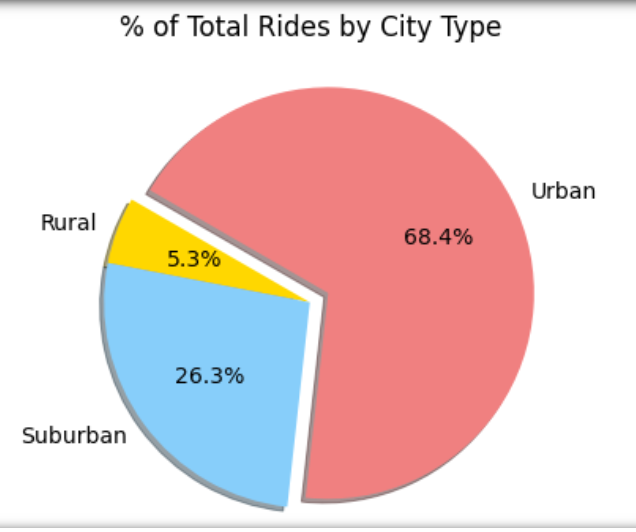

3. The graph illustrates the point that fares between the three locations don't traverse, proving the point that if the company decides to expand into the rural and suburban areas, the profit growth would be self-sustaining since there are no competition for fares from the other areas. This leads to a potential independent fare management for the company.

